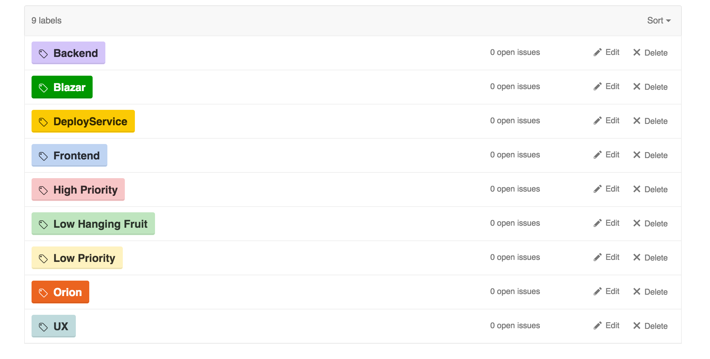

# PaaS-Build-Deploy
Internal repo for PaaS Build &amp; Deploy team

Issues are [here](https://git.hubteam.com/HubSpot/PaaS-Build-Deploy/issues)

Labeling Scheme:
- primary labels are the application / category that we own (Blazar, Orion etc.)  
- Modifier labels are modifiers tell you the priority and what kind of work (Backend, Frontend, Low Priority etc.)

